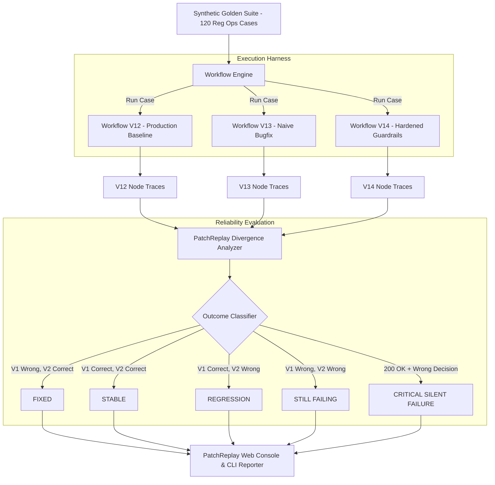

# PatchReplay ⚡
### AI Workflow Regression & Reliability Lab
> **Proof-of-Work Project for AI Reliability Intern at [Patched](https://www.workatastartup.com/companies/patched) (YC S24)**  
> *"Replay historical cases against a changed AI workflow to determine what was fixed, what still fails, what newly broke, and where the behavior changed."*

---

## 📌 Executive Summary

Enterprise AI agents in regulated operational workflows (FinTech, Banking Disputes, AML/KYC) face a fundamental challenge:

$$\text{Successful Execution (200 OK)} \neq \text{Correct Operational Action}$$

When an engineer modifies an AI agent workflow to resolve an edge case, they risk introducing **silent regressions**—where the agent finishes without error but executes an incorrect, non-compliant business decision.

**PatchReplay** is an engineering reliability system that:
1. **Ingests historical traces & production incidents** into a permanent golden test suite.
2. **Replays test suites across workflow versions** (`V12 Baseline` $\rightarrow$ `V13 Naive Bugfix` $\rightarrow$ `V14 Hardened Guardrails`).
3. **Classifies outcomes** into **Fixed**, **Stable**, **Regressed**, **Still Failing**, and **Critical Silent Failures**.
4. **Pins the exact node of divergence** via step-by-step side-by-side trace visualizers.
5. **Provides an interactive Guardrail Sandbox** to evaluate policy tweaks in real time.

---

## 🎯 Direct Alignment with Patched Role (AI Reliability Intern)

| Job Description Requirement | How PatchReplay Implements & Proves It |
| :--- | :--- |
| *"Review agent workflow traces and flag anomalies, bugs, and missing cases"* | Side-by-side **Trace Visualizer** inspecting inputs, LLM/Rule reasoning, decision impacts, and node divergence points. |
| *"Write simple Python scripts to spot patterns and automate checks"* | Python Core Engine (`backend/engine/comparator.py`) and standalone CLI (`backend/run_replay.py`) performing automated multi-version diffing. |
| *"Reproduce issues and clearly document what happened"* | **Trace-to-Test Ingestion Pipeline** converting production failure traces into repeatable regression tests. |
| *"Work with engineering to verify fixes"* | Direct $\text{V12} \rightarrow \text{V14}$ verification proving **12 fixed cases with 0 regressions**. |
| *"Critical thinking and pattern matching beyond technical skills"* | Distinction between software errors and **Silent Operational Failures** (e.g. auto-resolving high-risk fraud). |

---

## 🏛 Architecture & Engineering Workflow



---

## 🧪 The "20-Second Demo" Scenario

### Case `C-182`: The High-Value Silent Failure
* **Context:** $2,500 Cross-Border Transaction Dispute, Customer Trust: 85/100, Risk Score: 82 (High), Merchant Evidence: **Missing**.
* **Expected Ground Truth:** **`ESCALATE`** (Reg Ops Section 4.2 mandates human compliance review for high-value missing evidence).

```text
               WORKFLOW V12 (Baseline)                WORKFLOW V13 (Naive Bugfix)
Step 1:        Ingest & Normalize [OK]                Ingest & Normalize [OK]
Step 2:        Customer KYC Check [PASSED]            Customer KYC Check [PASSED]
Step 3:        Risk Assessment [HIGH RISK]            Risk Assessment [HIGH RISK]
Step 4:        Merchant Evidence [MISSING]            Merchant Evidence [MISSING]
Step 5:        Reg Ops Policy Engine                  Reg Ops Policy Engine
               Decision: ESCALATE (✓ Correct)         Decision: AUTO_RESOLVE (✕ Silent Failure!)
                                                              ▲
                                                    [DIVERGENCE DETECTED]
                                        V13 bypassed missing evidence rule for VIPs
```

* **The Takeaway:** The engineer who built V13 celebrated fixing 12 cases—unaware that they silently created 4 high-risk regressions. PatchReplay caught this immediately.

---

## 📊 Evaluation Metrics Summary

| Workflow Comparison | Total Cases | Fixed | Stable | Regressions | Silent Failures | Net Accuracy |
| :--- | :---: | :---: | :---: | :---: | :---: | :---: |
| **V12 $\rightarrow$ V13 (Naive Fix)** | 120 | **12** | 104 | **4** | **4** | $90.0\% \rightarrow 96.7\%$ |
| **V12 $\rightarrow$ V14 (Hardened)** | 120 | **12** | 108 | **0** | **0** | $90.0\% \rightarrow \mathbf{100.0\%}$ |

---

## 🚀 Quickstart & How to Run

### 1. Python Backend & Standalone CLI
```bash
# Navigate to repository
cd patchreplay

# Run full evaluation suite via CLI
python backend/run_replay.py --v1 v12 --v2 v13

# Inspect a specific case trace divergence (e.g. C-182)
python backend/run_replay.py --v1 v12 --v2 v13 --inspect C-182

# Run hardened verification (V12 -> V14)
python backend/run_replay.py --v1 v12 --v2 v14

# Run pytest unit & regression test suite
pytest backend/tests/
```

### 2. Launch FastAPI Service
```bash
uvicorn backend.app:app --host 127.0.0.1 --port 8000 --reload
```

### 3. Launch Web Application Console
```bash
cd frontend
npm install
npm run dev
```
Open **`http://localhost:5173`** in your browser.

---

## 📁 Repository Structure

```
patchreplay/
├── backend/
│   ├── app.py                      # FastAPI backend service endpoints
│   ├── dataset.json                # Synthetic Banking Operations Dataset (120 cases)
│   ├── run_replay.py               # Standalone colored terminal CLI runner
│   ├── engine/
│   │   ├── models.py               # Pydantic domain models for traces & metrics
│   │   └── comparator.py           # Regression classification & divergence algorithm
│   ├── workflows/
│   │   ├── base_workflow.py        # Base node graph interface & trace harness
│   │   ├── v12_baseline.py         # Baseline workflow with known false rejections
│   │   ├── v13_naive_fix.py        # Naive bugfix with silent failure regressions
│   │   └── v14_hardened.py         # Hardened fix with strict safety guardrails
│   └── tests/
│       └── test_replay.py          # Pytest regression suite
├── frontend/
│   ├── src/
│   │   ├── App.tsx                 # Main developer console application
│   │   ├── components/
│   │   │   ├── Navbar.tsx          # Version diff switcher & action controls
│   │   │   ├── MetricsOverview.tsx # 5 outcome summary cards & accuracy deltas
│   │   │   ├── RegressionMatrix.tsx# Filterable & searchable case table
│   │   │   ├── TraceVisualizerModal.tsx # Side-by-side node trace inspector
│   │   │   ├── PromoteIncidentModal.tsx # Incident ingestion to test suite
│   │   │   └── GuardrailSandbox.tsx# Interactive live rule simulation playground
│   │   ├── lib/
│   │   │   └── replayEngine.ts     # Client-side deterministic graph runtime
│   │   └── types.ts                # TypeScript interfaces
├── ARCHITECTURE.md                 # In-depth architectural & taxonomy design
└── DEMO_GUIDE.md                   # 20-second walkthrough script for interviewers
```

---

## 🔒 Synthetic Dataset Disclaimer
All transaction amounts, customer names, trust scores, and dispute logs used in this repository are **100% synthetically generated** for demonstration purposes. They reflect realistic regulated banking operations patterns without representing confidential data or proprietary infrastructure.
